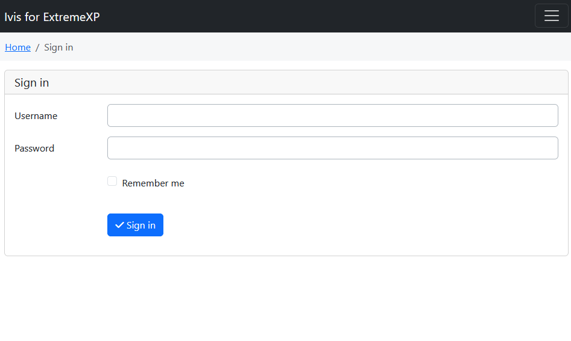

# ExtremeXP Data Abstraction Layer

This project is set up using Docker and Docker Compose to create a development environment for the `expvis` application. The environment includes services for MariaDB, Redis, and Elasticsearch, as well as a custom Node.js application with various dependencies.

## Prerequisites

- Docker
- Docker Compose

## Project Structure

- **Dockerfile**: Sets up a Node.js environment with OpenJDK 17, Maven 3.9.4, and Git. It also installs necessary npm packages and prepares the application for development.
- **docker-compose.yml**: Defines the services required for the project, including MariaDB, Redis, Elasticsearch, and the `expvis` application.

## Setup Instructions

*Note that these are the setup instructions for running `expvis` in Docker. For installation on your local machine (for development), follow the [instructions in `ivis-core`](https://github.com/smartarch/ivis-core/wiki/Local-installation-for-development).*

1. **Clone the Repository:**

   ```bash
      git clone --recurse-submodules <repository_url>
      cd <repository_directory>
      export DAL_REPO_PATH=<repository_directory>
   ```

1. **Update Configuration:**

   By default, the app is set to run on localhost on HTTP (via Docker). If you want to access it via a different URL and use HTTPS, change the `server/config/local.yaml` file and set the URL configuration:

   ```yaml
     www:
        trustedPort: 8443
        trustedPortIsHttps: false
        sandboxPort: 8444
        sandboxPortIsHttps: false
        apiPort: 8445
        apiPortIsHttps: false
      
        trustedUrlBase: {CHANGE to address of the host for base}
        sandboxUrlBase: {CHANGE to address of the host for sandbox}
   ```
   For exmaple, if you are running the `expvis` on a remote machine, set the IP of the machine as `http://x.x.x.x:8443` and `http://x.x.x.x:8444`.

1. **Build the Docker Images:**

   ```bash
      docker-compose build
   ```

1. **Start the Services:**

   ```bash
      docker-compose up
   ```

   This will start the following services:
   - **MariaDB** on port `3305`
   - **Redis** on port `6380`
   - **Elasticsearch** on ports `9200` and `9300`
   - **expvis aplication** on ports `8443`, `8444`, and `8445`

1. **Access the Application:**

   Once all services are up and running, you can access the ExpVis application via:

   - [https://localhost:8443](https://localhost:8443)
   - [https://localhost:8444](https://localhost:8444)
   - [https://localhost:8445](https://localhost:8445)

   While openning the localhost, the credential to login as admin are "username:admin" and "password:test" in the below interface

   

## Additional Information

- The Dockerfile installs OpenJDK 17 and Maven 3.9.4 to support Java-based components of the application.
- Submodules are initialized and updated to ensure that all dependencies are properly fetched.
- The `wait-for-it.sh` script is used to ensure that dependent services (MariaDB, Elasticsearch) are available before starting the application.
- Custom setup scripts and configurations are copied and executed as needed.

## Environment Variables

The following environment variables are set in the `docker-compose.yml`:

- **NODE_ENV**: `local`
- **MYSQL_USER**: `expvis`
- **MYSQL_PASSWORD**: `expvis`
- **MYSQL_DATABASE**: `expvis`
- **MYSQL_HOST**: `extremexp-dal-mariadb-1`
- **REDIS_HOST**: `extremexp-dal-redis-1`
- **ELASTICSEARCH_HOST**: `http://extremexp-dal-elasticsearch-1:9200`
- **DMS_PATH**: `/app/services/dms`

## Volumes

The following volumes are used to persist data:

- **mariadb_data**: Stores MariaDB data
- **redis_data**: Stores Redis data
- **elasticsearch_data**: Stores Elasticsearch data

## Notes

- Ensure that the Git credentials are properly set in the environment to allow submodule updates.
- The application uses a specific branch (`extremeXP`) for the [ivis-core](https://github.com/smartarch/ivis-core) repository.


# Deployed server
for the documentation check:
https://documenter.getpostman.com/view/37096355/2sA3sAio7d

# Swagger documentation
see [https://app.swaggerhub.com/apis-docs/ExtremeXP/extremexp-dal/1.0.0](https://app.swaggerhub.com/apis-docs/ExtremeXP/extremexp-dal/1.0.0)

